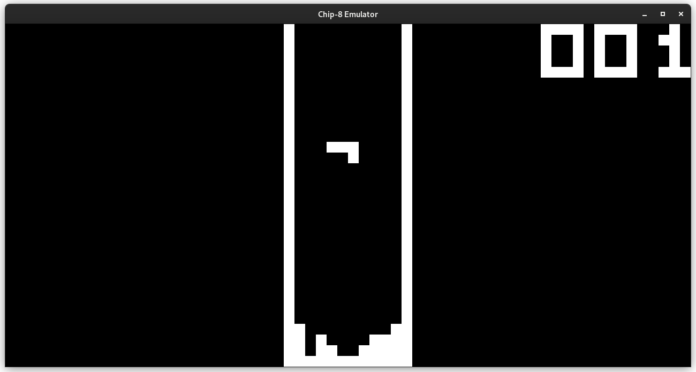
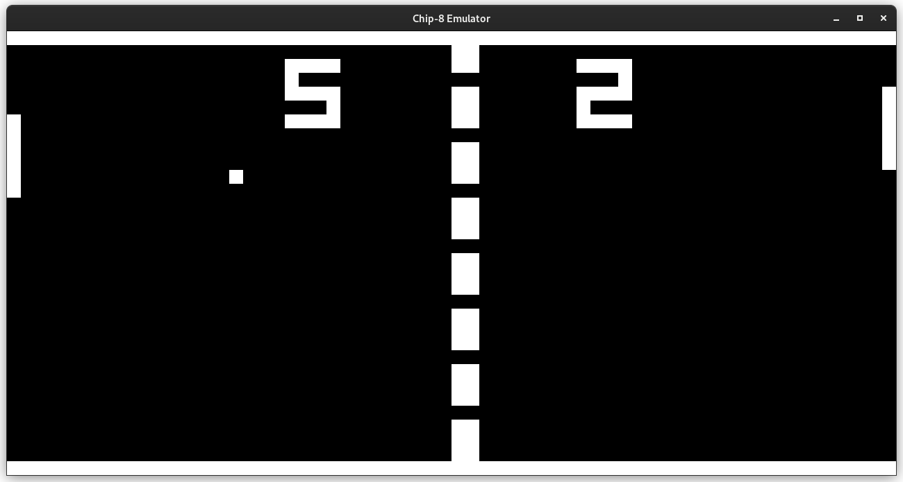
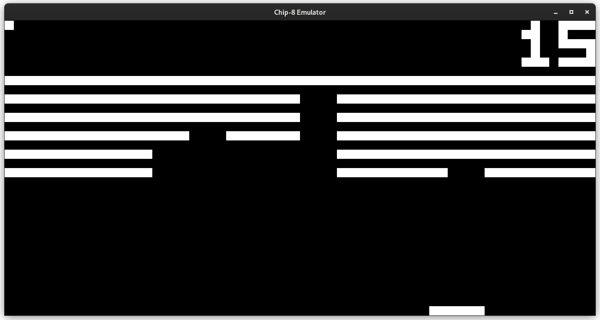

# Chip-8 Emulator

My CHIP-8 emulator project, written in C++.

I've not included any roms into this repo, but they're very easy to find on the internet, e.g. [here](https://github.com/kripod/chip8-roms) on GitHub.

## Background

CHIP-8 was created in 1977 for the COSMAC VIP microcomputer as a way to build games and programs which could be written in hexadecimal intructions rather than machine language.

It is technically an interpreted language, thus I've made an interpreter, not an emulator. Nonetheless, it's a very popular project in the emulation scene and often refered to as an emulator.

## Specifications

CHIP-8 has the following components:

- Memory: CHIP-8 has direct access to up to 4 kilobytes of RAM
- Display: 64 x 32 pixels monochrome, ie. black or white
- A program counter, often called just “PC”, which points at the current instruction in memory
- One 16-bit index register called “I” which is used to point at locations in memory
- A stack for 16-bit addresses, which is used to call subroutines/functions and return from them
- An 8-bit delay timer which is decremented at a rate of 60 Hz (60 times per second) until it reaches 0
- An 8-bit sound timer which functions like the delay timer, but which also gives off a beeping sound as long as it’s not 0
- 16 8-bit (one byte) general-purpose variable registers numbered 0 through F hexadecimal, ie. 0 through 15 in decimal, called V0 through VF
- VF is also used as a flag register; many instructions will set it to either 1 or 0 based on some rule, for example using it as a carry flag

## Screens

### Tetris



### Pong



### Breakout



## Useful links

### Wikipedia - [link](https://en.wikipedia.org/wiki/CHIP-8#Registers)

Wikipedia is honestly enough to build the entire emulator. It covers all the computing specifications required, and a great list of the opcodes and what they do.

### Tobias V. Langhoff's Guide to making a CHIP-8 emulator - [link](https://tobiasvl.github.io/blog/write-a-chip-8-emulator/)

This was an incredibly helpful resource. It walks through the architecture and requirements without giving the actual implementation details or any code. Enough to build the emulator yourself without being spoonfed.

## Build

[SFML](https://www.sfml-dev.org/) must be installed for your respective operating system.

To compile:

```bash
make release
```

To play a game:

```bash
./bin/chip8 /path/to/.ch8/rom
```
